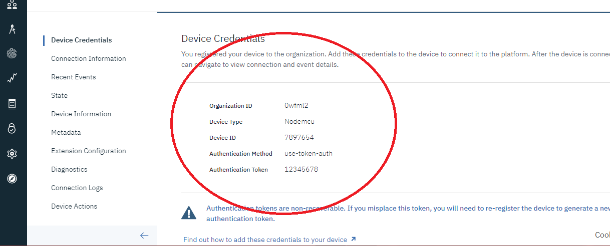
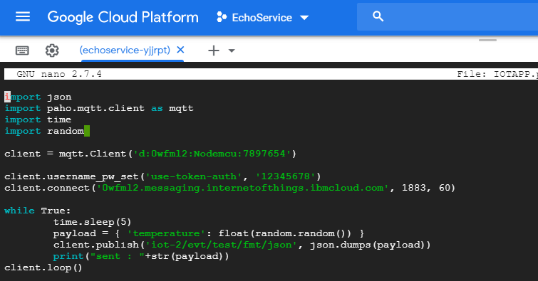
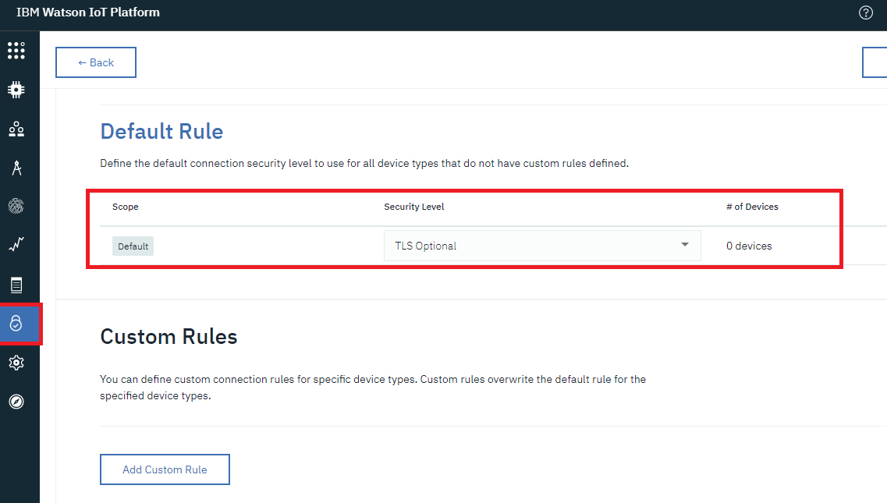
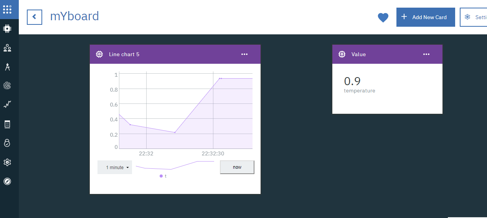

# IOT-Internet-of-Things-
In this repo i used internet of things with different different platforms. 
<h1>1.IBM</h1>
1. It is very to use Simply create account of IBM and create one instance of Internet of things.
ADD DEVICES: Device Types, Device ID, Authentication token mandatory
This is 3 step process. Note down all the details.

2. Now add the relavant fields in a particular language. I used python and simply run using command python IOTAPP.py

3. Dont forget to change the security settings inside security -> Connection security -> Make TLS OPtional

NOTE: IF YOU ARE USING THE REST API FOR IOT TO SEE THE DATA (DATA WILL BE ENCRYPTED WITH THE BASE 64 SO FIRST WE NEED TO DECRYPT THAT DATA THEN IT WILL BECOME NORMAL STRING).
REST URL: https://ORGID.internetofthings.ibmcloud.com/api/v0002/device/types/DEVICE_TYPE/devices/DEVICE_ID/events/event_id
event_id = iot-2/evt/test/fmt/json (in this test is a topic and test is a event_id)
 
<h3>Graphing the sensor data to ibm cloud : </h3>
 
<h4>Follow these steps:</h4> 
Goto Boards -> add board -> inside new created board create one card select line char -> 
-> select device -> connect new dataset -> event should be (iot-2/evt/test/fmt/json) test in this case ->  
select property temperature in this case ({"temperature":"0.29"})json that we are sending (key value). -> Type Integer and units accordingly 
Choose colours and name accordingly and graph is ready 
Enjoy the Cloud
