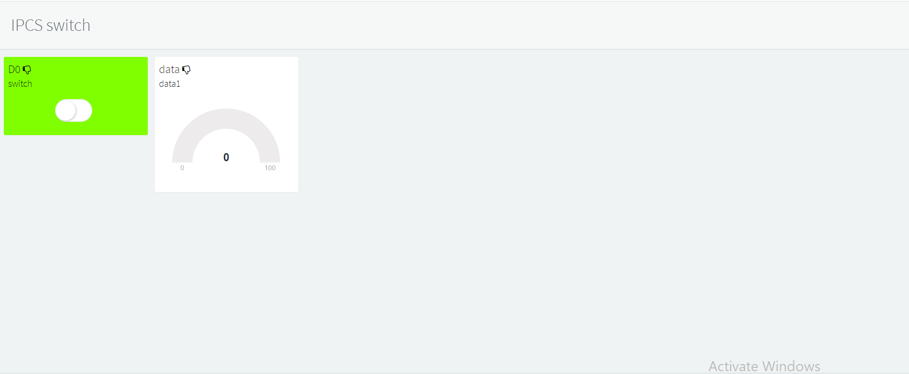

# Introduction
This is a general example of Thinger.io service used with the wemos d1 mini. It can perform event based and timing based operations like turning on off light and sensor data to the server

# How to run?
Step 1: First create one account on thingers.io, after creating one account choose device and fill all the data about your controller which you will use for your project.(device ID, device description, device credential ) 

Step 2: after that open arduino IDE and add thingers.io library and install the ESP8266 board (I used ESP8266 board for my project)  

Step 3: after that go to thingers.io examples and select ESP8266 examples and add all the credential of device which you filled in the thigers.io, and add wifi username and password.  

Step 4: after that go to thingers.io and choose dashboard and select add widget and fill details and add resources and choose display and create dashboard to control the controller.  

Step 5: upload the code to the controller and enjoy your IOT device.

Happy coding!
