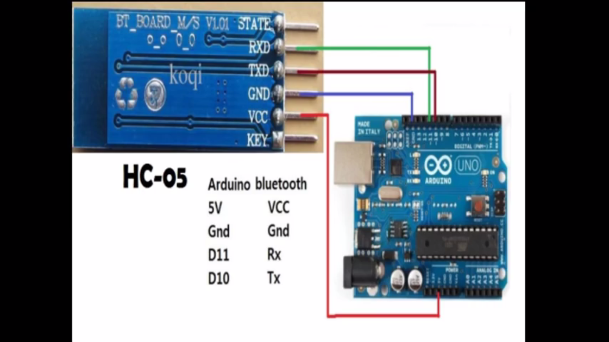

# Introduction
This is basic home automation project using Arduino and HC05. Using this project we can automate our home using Text or by speaking. 
# How to use?
Simply make the connection with arduino and HC05

Upload the code using arduino or platform.io.
Download the apk app from the repo and install in android phone and connect with the hc05 but before that connect simple bluetooth using password 1234. Then done you can use this project.
# Demo
 
https://www.linkedin.com/posts/narayan-jha-aa3b2b13a_jarvis-realtime-homeautomation-activity-6518713976086458368-3tzW/
